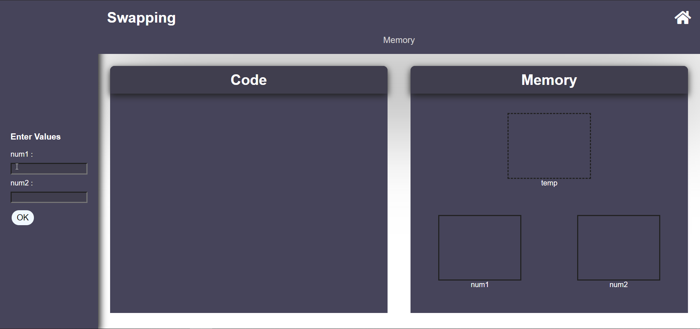
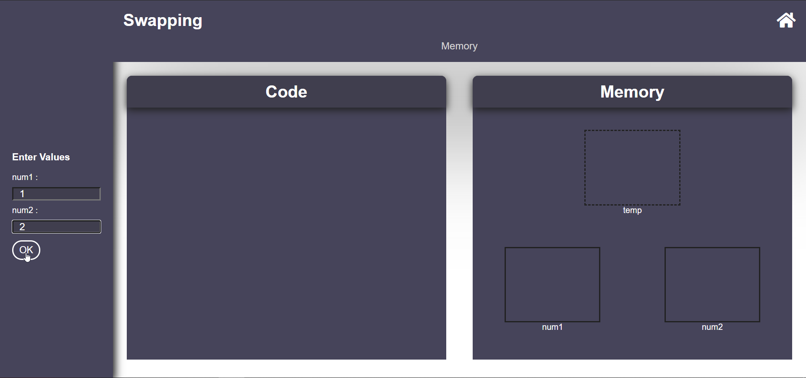
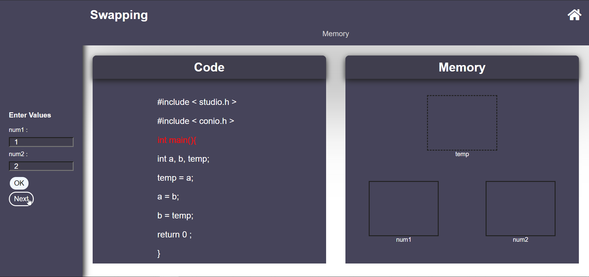
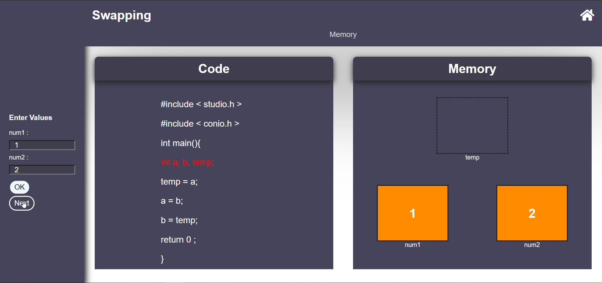
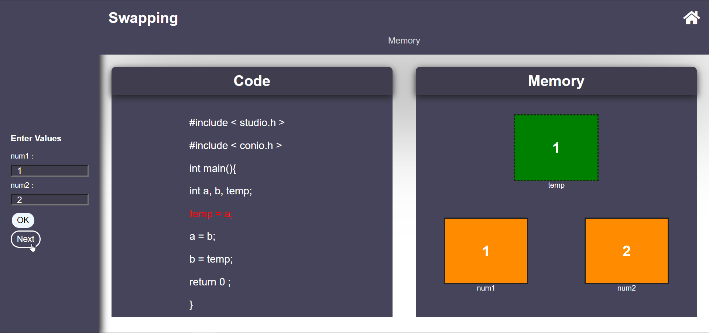
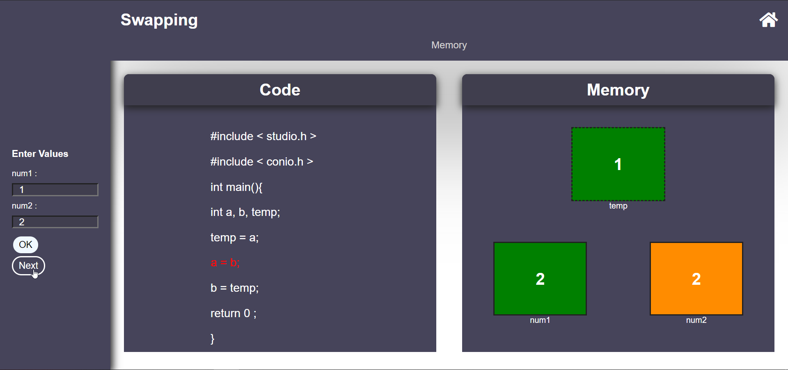
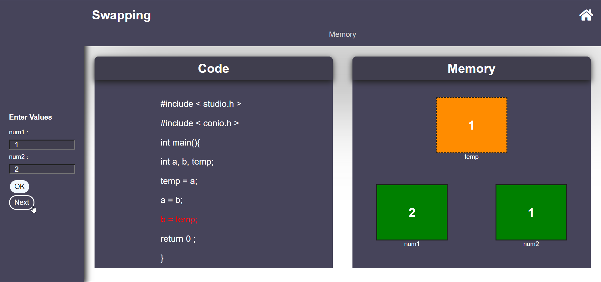
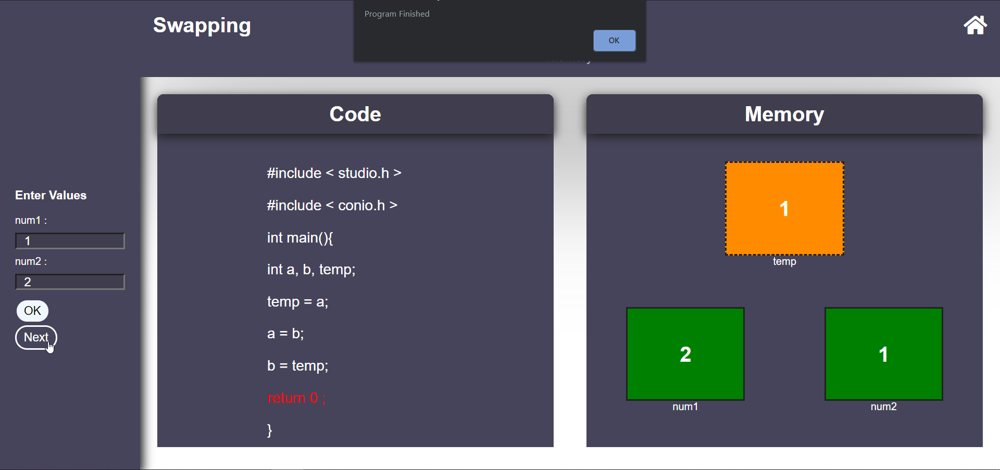

## Storyboard (Round 2)

Experiment 1: write a program swaps values of two variables using a third variable.

### 1. Story Outline:

Swapping is a technique in which variables exchange their values. In computer programming, the act of swapping two variables refers to mutually exchanging the values of the variables. Usually, this is done with the data in memory.

### 2. Story:

This experiment is based on swapping of two number using third variable  from the given input of the user. The experiment will start by the input of user, User will have to give two numbers as a input. And the program will swap those number from their memory location or variable.. Usually, this is done with the data in memory.The simplest and probably most widely used method to swap two variables is to use a third temporary variable.we will assign the value of num1 to the value of variable named temp and then then the value of num2 will assign to the value of num1 and after that the value of temp will assign to the value of num2.And this is how the program will swap those numbers.

#### 2.1 Set the Visual Stage Description:

Simulator starts with the experiment name on the top and asking for two numbers. Simulator consist of three blocks, at the left, the simulators asks for two inputs from the user. User will have to give two numbers and then click on OK button. After that user will click on NEXT then both number will show in the memory block of the simulator. And then the user will have to press next until the program finishes. At the execution of the program the numbers will be swapped and will show in the memory block of the simulator. 

#### 2.2 Set User Objectives & Goals:

1. The main objective of the user is to swapp two numbers using third variable. 
2. To get to know about the swapping of variables.
3. To understand the assiging of variables.
4. User need to answer some question based on the experiment. 

#### 2.3 Set the Pathway Activities:

1. User starts the simulator.
2. User enters the two numbers.
3. User click on OK .
4. Code will be visible in the code block.
5. User click on NEXT.
6. Smulator displays both numbers in the memory block.
7. User click on NEXT.
8. The value of num1 will assign to temp.
9. User click on NEXT.
10. The value of num2 will assign to the value of num1.
11. User click on NEXT.
12. The value of temp will assign to num2.
13. The number has been changed.
14. program finished.

##### 2.4 Set Challenges and Questions/Complexity/Variations in Questions:

Difficuty level: Remember 
Q1- Special symbol permitted with in the identifier name. 
(a) $  
(b) @  
<b>(c) _ </b>  
(d) .  

Difficuty level: Apply 
Q2-  How many variables will be assigned for swapping of two numbers using third variable ? 
(a) 1  
<b>(b) 3 </b>  
(c) 6  
(d) Non of them  

Difficulty level: Evaluate 
Q3- What will be the data type of the variables ? 
<b>(a) Only same data type </b> 
(b) May be same data type 
(c) Diffrent data type 
(d) Non of above 

Difficulty level: Evaluate 
Q4- If we assign two variable int and one variable float then what type of error will perform in that program ? 
<b>a) Run time error <b> 
(b) Compile time error 
(c) Logical error 
(d) Non of above 

Difficulty level: Apply 
Q5-  While swapping of two variable which side of the variable's value assigned to which side of variable ? 
(a) Left to Righ 
(b) Right to Left 
<b>(c) Both </b> 
(d) Non of above 

##### 2.5 Allow pitfalls:

There are pitfalls in the simulator, mentioned below:

1. User will get an error message if user presses ok without giving input.
2. User will get an error message if user enter string(alphabets or symbols) input.
3. User should not enter same values in the input field.

##### 2.6 Conclusion:

In this whole experiment, User will be able to learn deep concepts after implementing things by doing hands-on tasks. This contains tasks separately to each learning objective mentioned by us. Generally, it will take almost half an hour to perform the experiment and to grasp the concept fully. Based on the successful completion of the experiment, user will be able to describe the swapping of two numbers using third variable. Hence with this, all the mentioned learning outcomes can be taken with the user.

##### 2.7 Equations/formulas: NA

temp = a; 
  a=b;  
b=temp; 

### 3. Flowchart 4
 
link to flow chart Here : Store in the  /flowchart folder within Round2 folder in your repo
 
(guide :The lab proposer should extract logic from the story, prepare a flowchart from the story narration and write the algorithm to execute the black box.  use Google Drawings https://docs.google.com/drawings/ (send the link to your flowchart and also attach .png by exporting it )

### 4. Mindmap:

 Link to mindmap here : Store the mindmap in both .mm & .png extension in the  /mindmap folder and include link of only .pdf verison here
  
 (guide : An elaborate mind map (connecting all the points in the experiment flow ) should be prepared and submitted by the lab proposer. The mind map should be a clear and detailed document that takes into account all minute intri5acies involved in the development of virtual lab. The mindmap should be self-content and any developer across the globe should be able to code it with all those details. using only FreeMind http://freemind.sourceforge.net/wiki/index.php/Main_Page (send the .png file and also the original .mm extension project file. )

### 5. Storyboard :

 
 
 
 
 
 
 
 
 