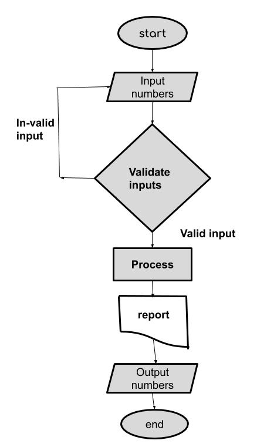

## Storyboard (Round 2)

Experiment 1: Write a program that swaps values of two variables using a third variable.

### 1. Story Outline:

Swapping is a technique in which variables exchange their data values. In computer programming, the act of swapping two variables refers to mutually exchange the data of the variables.

### 2. Story:

This experiment is based on the swapping of two numbers using the third variable from the given input of the user. The experiment will start with the input given by the user, after that with the help of the program user will swap those (values in) numbers from their memory location. In this experiment firstly, the value of num1 will be assigned to the variable named "temp" and then the value of num2 will be assigned to num1 and after that, the value of "temp" will be assigned to num2. In the last, values of the variables will be swapped.

#### 2.1 Set the Visual Stage Description:

The simulator starts with the experiment name on the top and asking for the input of two numbers. The simulator consists of three blocks, in the left, Input block, in middle, Code block and in right, Simulation block. The simulator asks to input numbers. User will have to input two numbers and then click on the "OK" button, if the input is in a proper format simulator will allow user to proceed with "NEXT" button, then both numbers will be shown in the memory block of the simulator. After that, the user will have to press "NEXT" button until the program finishes. By clicking the NEXT button, user visualize the execution of code and changes in values of the variables in Memory block and Code block. At the completion of execution of the program user will be able to see swapped numbers in the memory block of the simulator. 

#### 2.2 Set User Objectives & Goals:

1. The prime objective of the user is to swapp two numbers using third variable. 
2. To get to know about the swapping of data in the memory cell.
3. Users need to answer some questions based on the experiment. 

#### 2.3 Set the Pathway Activities:

1. User starts the simulator.
2. User enters the values of two numbers.
3. User clicks on the "OK" button.
4. Code will be visible in the code block.
5. User click on "NEXT" button.
6. The simulator will display both numbers in the memory block.
7. User click on "NEXT" button.
8. The value of num1 will assign to temp.
9. User click on "NEXT" button.
10. The value of num2 will assign to the value of num1.
11. User click on "NEXT" button.
12. The value of temp will assign to the value of num2.
13. The number has been changed.
14. User clicks on "NEXT" button then a pop-up box appears with text "Program over".

##### 2.4 Set Challenges and Questions/Complexity/Variations in Questions:

Difficuty level: Remember 
Q1- Special symbol permitted with in the identifier name. 
(a) $  
(b) @  
<b>(c) _ </b>  
(d) .  

Difficuty level: Apply 
Q2-  How many variables will be assigned for swapping of two numbers using third variable ? 
(a) 1  
<b>(b) 3 </b>  
(c) 6  
(d) Non of them  

Difficulty level: Understand 
Q3- What will be the data type of the variables ? 
(a) int</b> 
(b) float 
(c) char 
<b>(d) Both (a) or (b) </b> 

Difficulty level: Apply 
Q4- If we assign two variable int and one variable float then what type of error will perform in that program ? 
<b>(a) Run time error</b> 
(b) Compile time error 
(c) Logical error 
(d) Non of above 

Difficulty level: Remember 
Q5-  While swapping of two variables which operator is used for assignment ? 
(a) == 
(b) is equal 
<b>(c) =</b> 
(d) Non of above 

##### 2.5 Allow pitfalls:

There are pitfalls in the simulator, mentioned below:

1. User will get an error message in a pop-up box if user presses "OK" button without providing the inputs.
2. User will get an error message in a pop-up box if user enter string(alphabets or symbols) as inputs.
3. If user provide same values in both the input fields, pop-up box will appear with message "provide diffrent inputs".

##### 2.6 Conclusion:

In this laboratory, the students will learn to enforce theoretical concepts of C programming language for finding a solution to a problem. Specifically, for the problem of mutually exchanging values of two variables of the same data type. In this experiment, user will learn how to use concepts of c programming language to find the solution of the problem of swapping of two numbers using third variable . Based on the successful completion of the experiment, users will be able to describe the swapping of two numbers using third variable. Hence, with this all the mentioned learning outcomes can be taken by the user.

##### 2.7 Equations/formulas:

temp = num1; 
num1 = num2;  
num2 = temp; 

### 3. Flowchart
 

### 4. Mindmap:

### 5. Storyboard :

 
 
 
 
 
 
 
 
 
 
 

